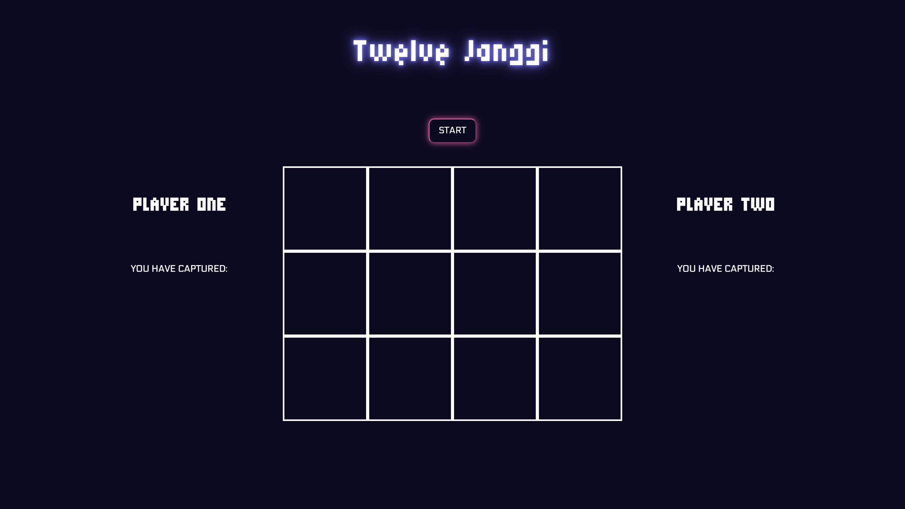
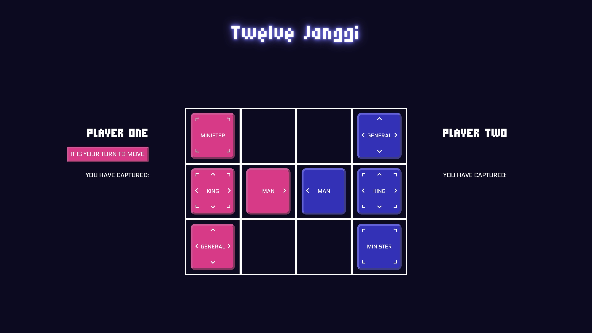
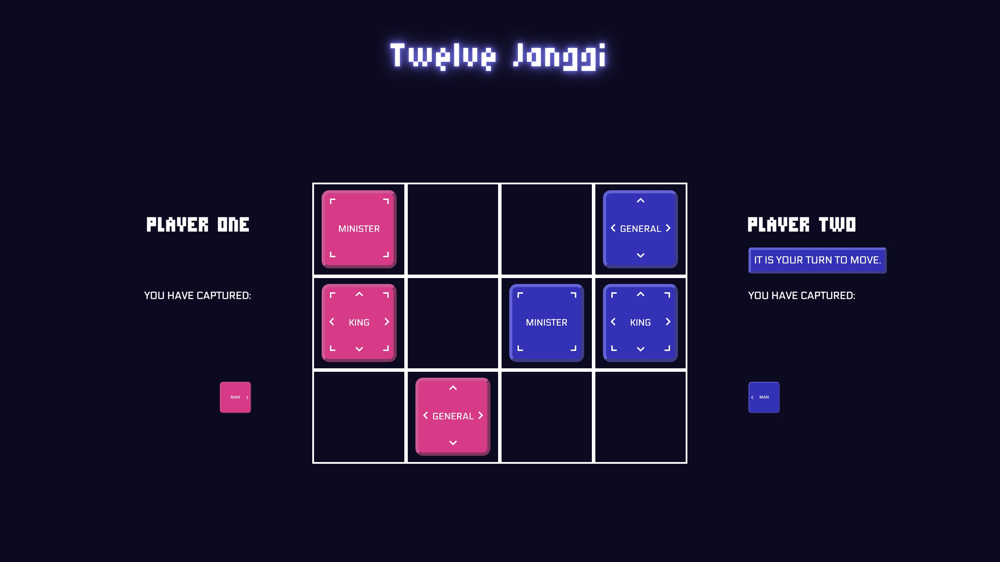
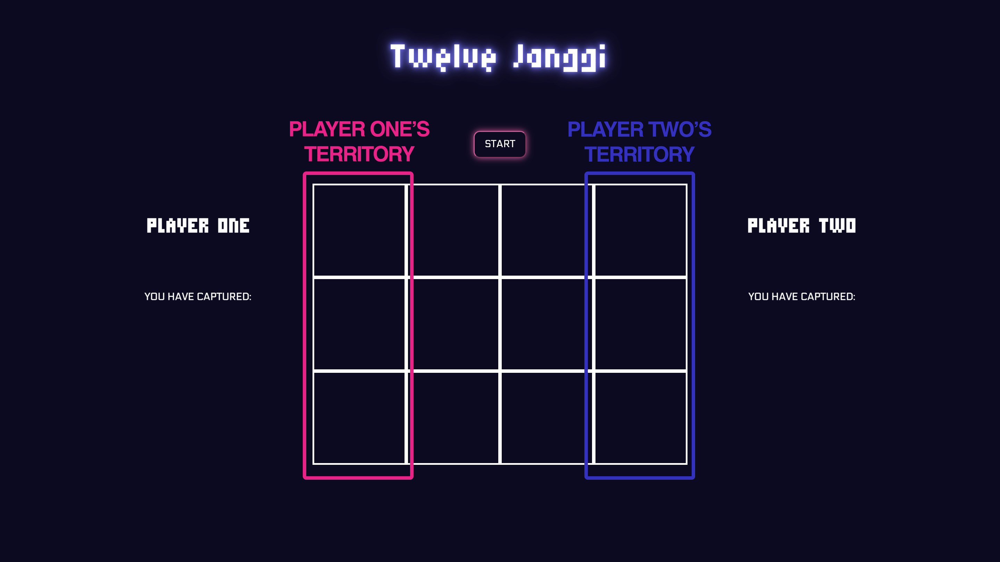
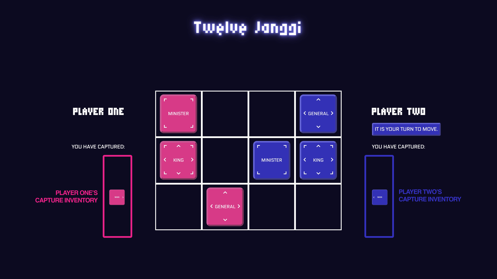
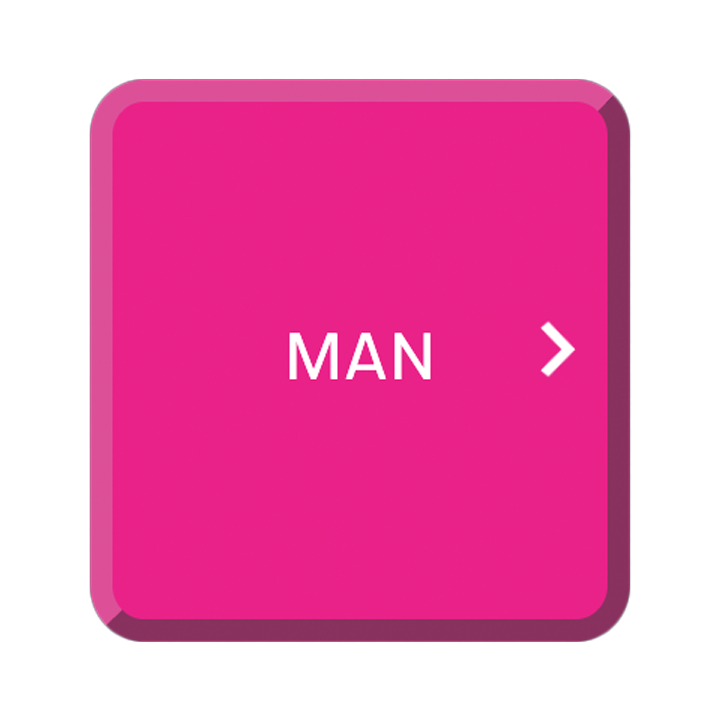
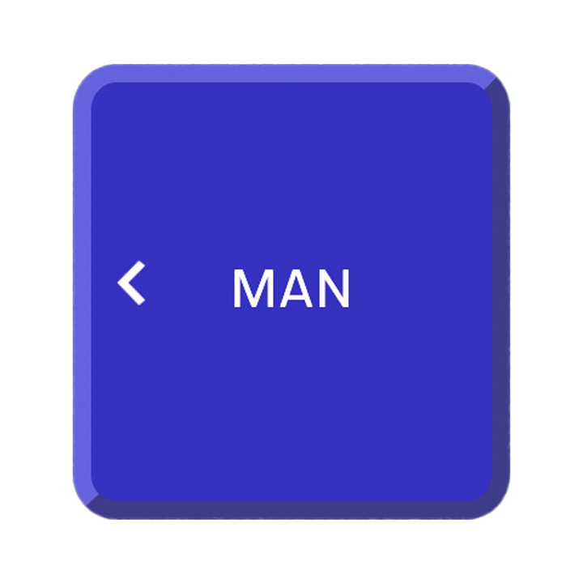
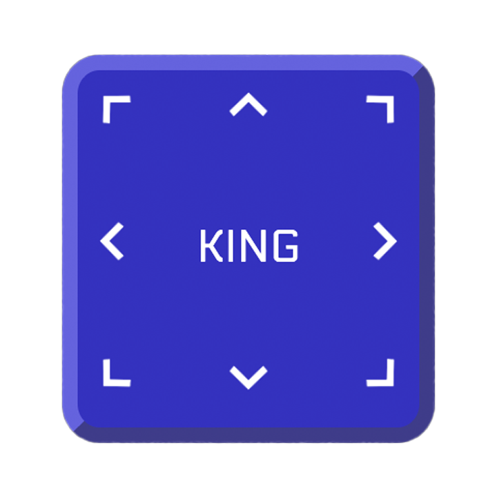
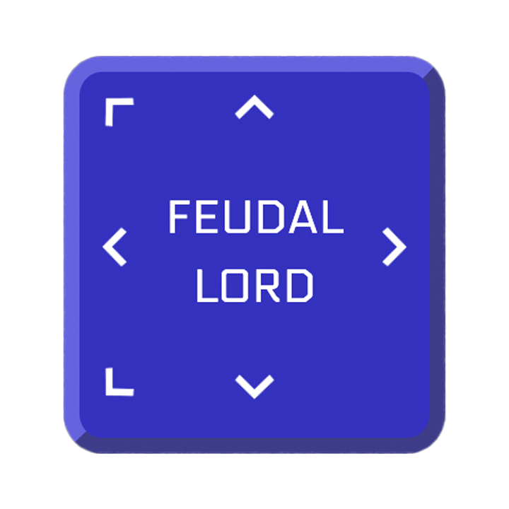

# Twelve Janggi

Twelve Janggi is a strategic, turn-based game that draws similarities to chess, based on the game featured in the South Korean television show “The Genius”. The game is played between two players, each taking turns to capture the opponent’s King piece.

## Screenshots

### From the Game

Landing Page:

Game Board with Starting Position:

Game Board with Captured Pieces:

### Referred-to Terminologies

Territories:

Capture Inventories:

## Technologies Used

Vanilla JavaScript, HTML, CSS

## Getting Started

### Pieces

| Piece Name       |                     Player 1                     |                     Player 2                     |
| ---------------- | :----------------------------------------------: | :----------------------------------------------: |
| Man              |            |            |
| General          |    |    |
| Minister         |  |  |
| King             |          |          |
| Feudal Lord [^1] |     |     |

[^1] "Feudal Lord" is an upgraded version of a "Man", which happens when a player’s "Man" piece reaches their **opponent’s territory.**

### Gameplay Rules

- The objective of the game is similar to chess; to capture the opponent’s "King" piece.
- Each piece is only allowed to move to an adjacent tile within the grid, following the directions indicated on each piece.
- Piece can only move if the destination tile is empty or occupied by an opponent’s piece. In the latter instance, the opponent’s piece that occupied the space will be captured.
- The captured opponent’s piece will then become yours and move to your **captured inventory**, allowing it to be placed back on an empty space on the grid during any of your turn.
  ==In the case that a "Feudal Lord" is captured, it will reset its abilities and return to a normal "Man".==
- Placing a captured piece back on the grid will consume one whole turn. Placing them directly on your opponent’s territory is not allowed.
- Have fun playing!

## Next Steps

Planned future enhancements:

- a randomiser to set starting player
- a timer for each player
- colour overlay to indicate possible tiles for piece to land on
- different game modes, including single player VS computer

## References

- [W3Schools](http://w3schools.com)
- [MDN Web Docs - Mozilla](http://developer.mozilla.org)
- [Stack Overflow](http://stackoverflow.com)
- [Unused CSS](http://unused-css.com)
- [JS Fiddle](http://jsfiddle.net)
- [W3docs] (http://w3docs.com)
- [CSS-Tricks](http://css-tricks.com)
- [freeCodeCamp](http://freecodecamp.org)
- [Google Fonts](http://fonts-google.com)
